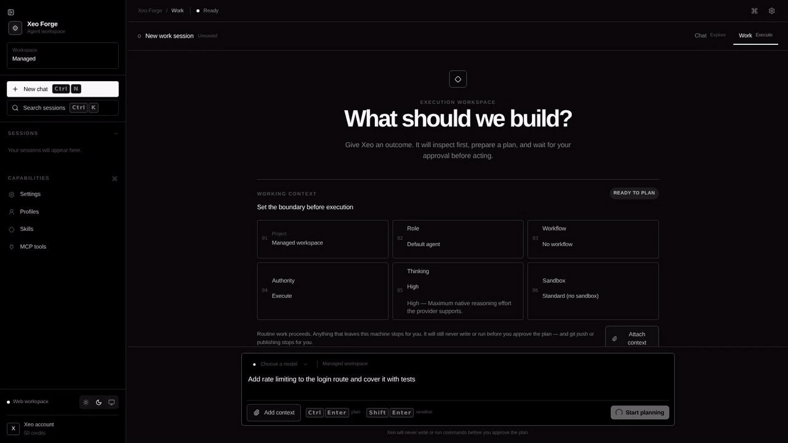
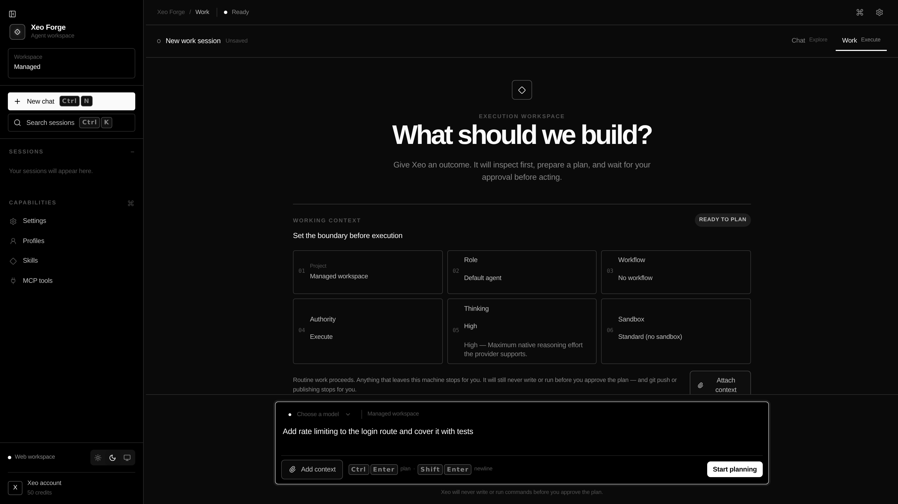
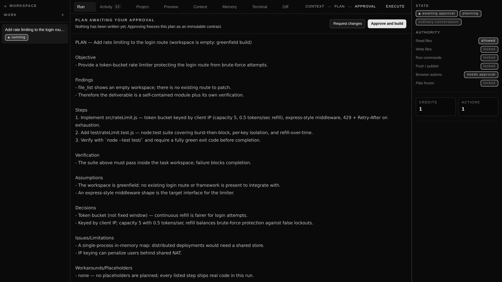
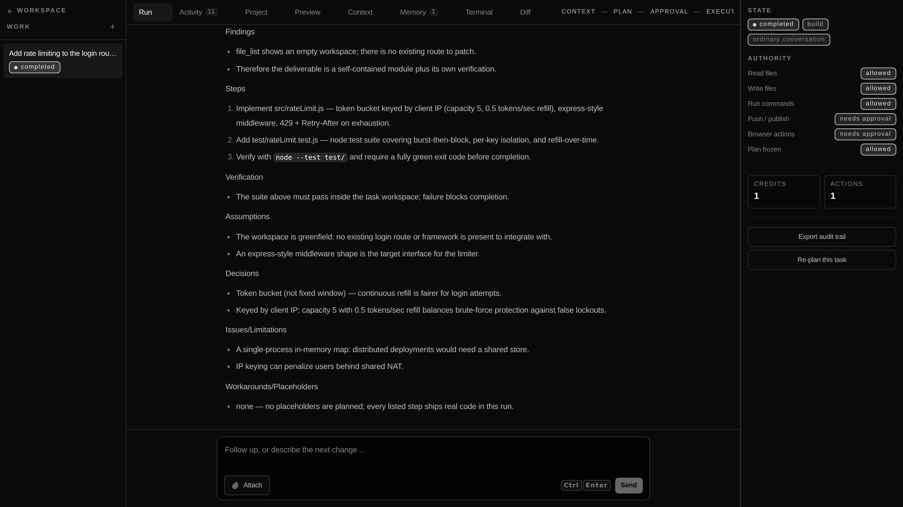
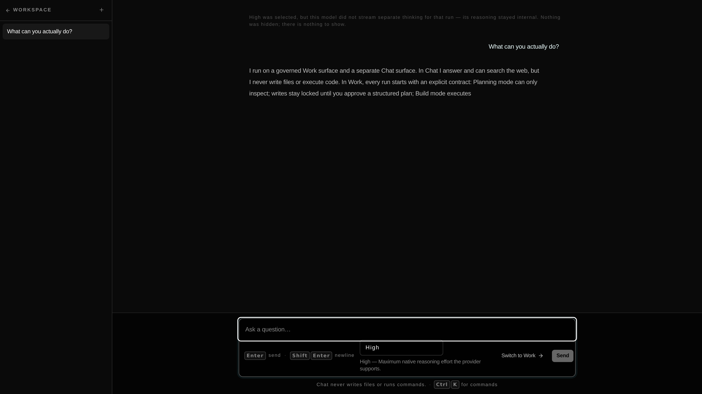
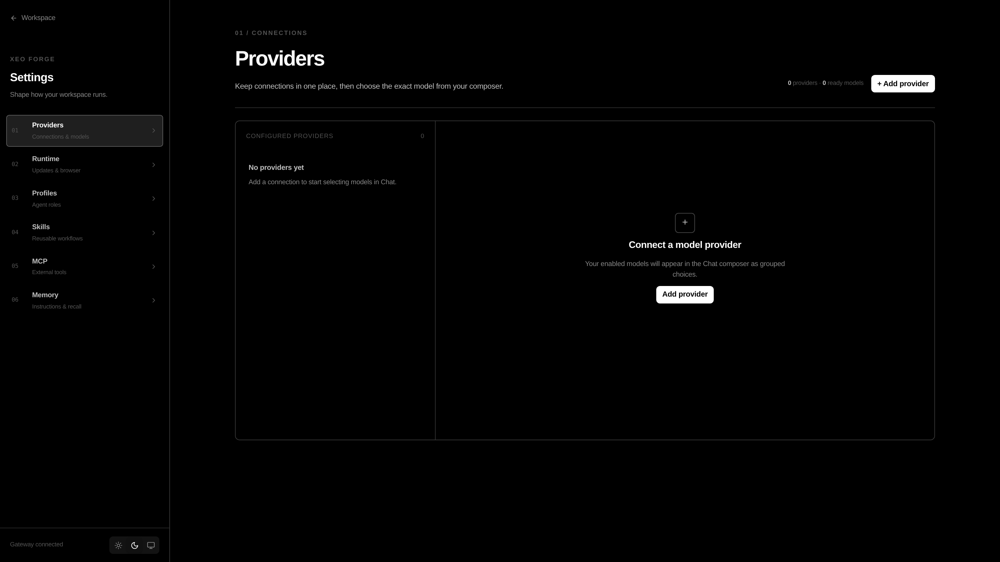
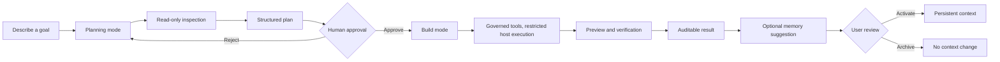

# Xeo Forge

<p align="center">
  
</p>

<h2 align="center">The Control Plane for Agentic Work</h2>

<p align="center">
  <em>Agents can act. Xeo Forge makes them accountable.</em>
</p>

<p align="center">
  <a href="https://github.com/lahkiri/xeo-forge/blob/master/LICENSE"></a>
  
  
  
  
  
</p>

Xeo Forge is a **local-first control plane for agentic work**. It gives software-building and knowledge-work agents a governed Work surface, a separate ordinary Chat surface, persistent context, reusable profiles and skills, workspace-scoped file boundaries, live event history, an optional user-controlled browser, and an installable desktop runtime.

The product is built around one principle:

> **Give your agent a forge, not a blank check.**

## Product identity

**Xeo Forge is not another terminal wrapper and not a cloud-only agent.** Claude Code, Codex, and OpenCode are powerful execution surfaces for developers. Manus and Cowork are broader general-purpose agents. Xeo Forge occupies the local control-plane layer: it is the place where a person or team defines how agents should behave, what they may remember, which local browser they may inspect, what they may execute, who must approve them, and how their work is reviewed.

The short version is:

> **Your agents can execute. Xeo Forge gives execution a policy, a memory, an audit trail, and a proof of work.**


## What the agent can do — and who decides

| Capability | What it is | Who decides |
|---|---|---|
| **Files** | Workspace-scoped reads/writes (realpath-checked boundary) | Writes unlock only after plan approval |
| **Git** | status / diff / log / branch / checkout / add / commit / revert — a closed vocabulary; no push, no reset, no history rewriting | Read ops in every mode; write ops in Build only |
| **Terminal** | A real host PTY per task (xterm.js), scrollback, resize, reconnect | You open it; a finished run closes it |
| **MCP** | Your own stdio servers, namespaced tools through the same approval gate | Only you can add, edit, or delete a server |
| **Diff review** | Every change inspectable line-by-line; click a changed file to diff it | The Diff tab is the receipt for every run |
| **Preview** | Analyze, start, stop project previews with readiness detection | Starts host processes → Build mode only |
| **Browser** | Read-only inspection via your browser profile | Navigation/interaction behind an explicit policy |
| **Memory** | Bounded proposals after each run | Nothing enters context until you keep it |

Where this sits in the market: **Claude Code / Codex / OpenCode are execution surfaces; Manus is general autonomy; OpenHands orchestrates many agents anywhere. Xeo Forge is the one where a single agent works on your real project while you stay in charge** — see [the OpenHands analysis](docs/competitive/openhands-analysis.md).

Per-release changes now live in [docs/RELEASES.md](docs/RELEASES.md).

## Watch it work — before you configure anything

Desktop Local ships with a **recorded governed run**: press *Watch it work* on the Work surface and the full loop replays in front of you — read-only inspection, a plan you would approve, gated build writes with live file activity, a green verification gate, and memory proposals awaiting your decision. No API key, no account, works offline. The replay is labeled as a recording everywhere it appears; we don't fake live runs.

## Product preview

Live captures from the running application (master, dark theme). The GIF is a real
governed run — the real loop, guards, tools, persistence, credits, and UI — with only
the model scripted by the repo's demo provider (`scripts/demo-provider.mjs`); the run
plans, waits for approval, builds real files, executes the real test suite, and
completes with memory proposals.



| The contract before execution: six knobs stated up front | The approval gate: nothing written yet — approving freezes the plan |
|---|---|
|  |  |

| Completed build: tests green, memory proposals awaiting your review | Chat surface — answers and web search, never writes | Control Center — one global model, admin truth |
|---|---|---|
|  |  |  |

## Core workflow



## Why the control plane matters

Most agent products optimize for autonomy. Xeo Forge optimizes for **useful autonomy with a visible boundary**. The agent can inspect a codebase, plan a change, edit files, execute verification, and show a preview, but the transition from planning to writing is explicit and persisted.

The same principle applies to memory. Xeo Forge does not silently treat every conversation as permanent training. It extracts bounded memory candidates only after successful work, records their source and confidence, and exposes approval, archive, and delete controls.

## Runtime guarantees

- Planning mode cannot write files or execute code, even if the model attempts to call a write tool.
- Approved plans are snapshotted before Build mode and are not silently rewritten during execution.
- Task events use one persisted sequence and one replay path, avoiding divergent in-memory histories.
- A run that reaches a terminal state closes the terminal sessions it owned — no orphan shells.
- Guard thresholds adapt to the model tier: frontier models get room for legitimate iterated loops; every other model keeps the strict historical limits.
- Read-only tool batches execute in parallel (bounded); anything that can mutate stays sequential, and the audit stream order is deterministic either way.
- File and code access is confined to the task workspace with path checks and command guards.
- Credits are debited atomically and every balance change is recorded in a ledger.
- Model API keys are kept server-side; the application uses one global model configuration.
- Context usage is measured from the live message array and can trigger automatic compaction.
- Memory suggestions are scoped, bounded, source-linked, and reviewable. A proposed memory is never injected into a run; only an explicitly kept memory reaches context.
- Approved memories that reach a run are recorded as a `context_layers` event, so memory cannot act invisibly.
- The Context Inspector reads the same resolution pass the agent loop uses, so it cannot report a layer the model did not receive.
- Code execution is restricted host execution: an environment whitelist, realpath-checked workspace boundaries, and a dangerous-command blocklist. It is not OS-level isolation.

## Current scope and honest boundaries

Xeo Forge is a strong local-first foundation, not yet a full replacement for every capability in Manus, Claude Code, Codex, OpenCode, Hermes Agent, or OpenHands. The current release is strongest at controlled software-building workflows, operator visibility, local persistence, governed Browser Bridge actions, and reviewable memory.

### Wired end-to-end (connectivity-audited)

- **Autonomy levels** (v1.21): rule-set data evaluated at the single dispatch chokepoint; the level you choose is the policy that executes. An unresolved `ask` still **fails closed** with a rule citation rather than pausing for an interactive approval conversation (interactive queue is tracked follow-up; silently proceeding would read as `allow`, the escalation this layer exists to prevent).
- **Thinking-effort levels** (v1.23): Minimal → Ultra, each classified **native vs hybrid** honestly in the UI (`(+sim)` marks prompt-simulated passes); a `thinking_level` audit event records what the run actually used, and a completed run that streamed no reasoning at a level above Minimal says so explicitly instead of implying hidden thinking.
- **Parallel subagent delegation** (v1.23): `delegate_research` fans out 2–4 read-only subagents that inherit the parent task's exact authority and dispatch through the same rule gate, with `sub-N` attribution on every audit event.
- **Sandbox tiers** (v1.23): standard (honestly labeled "no OS-level isolation"), strict (extra deny rules as data), docker (real container isolation: workspace bind-mount, CPU/memory/pids caps, network off). Docker presence is probed per run — unavailable Docker fails closed with an actionable message and a consent-first guided install; nothing downloads silently.

### Known gaps (disclosed on discovery, per the honest-gap-discipline)

1. **Per-task permission overrides have no path to the loop yet.** The loop accepts `permissionOverrides` and the denial messages tell users to add an explicit per-resource override — but no schema column, API field, or UI supplies them today. Until this ships, the supported way to unblock an `ask` is raising the task's authority level.
2. **GUI zone rules are enforced logic without a runtime consumer yet** (evaluation is exercised by contract tests only; the desktop shell does not call `evaluateGuiAct` in v1.23).
3. **Docker sandbox tier covers execution tools** (`code_execute` bash/python); interactive terminal sessions still run on the host with a visible warning when the docker tier is selected.
4. **Multi-platform presence** (Telegram/Discord, as Hermes offers) and **live skill self-improvement** (Hermes rewrites its skills from experience) are deliberately out of scope for v1.23 — see the competitive analysis below.
5. **Subagent delegation is read-only by construction** in v1.23; write-capable parallel delegation waits for a proven concurrent-write design.
6. **Subagents still have no per-subagent follow-up or model override** (disclosed in the v1.25 desktop-parity batch): the v1.25 batch delivered the delegation Settings section and wider honest documentation, but per-subagent messaging/model choice requires loop-level design that was not rushed in. The Settings → Subagents page states this boundary verbatim.
7. **Split/collapse layout controls for Chat and Work panes are not built yet** (v1.25 batch item, lowest priority): the panes use fixed widths; a resize/collapse control is a UX refinement queued after the functional fixes.

### How we compare — Hermes Agent and OpenHands (verified, not vibes)

Full evidence-backed studies live in [docs/competitive/hermes-analysis.md](docs/competitive/hermes-analysis.md) and [docs/competitive/openhands-analysis.md](docs/competitive/openhands-analysis.md). The short, honest version:

| | Hermes Agent | OpenHands | Xeo Forge v1.25 |
|---|---|---|---|
| Loop | Budget-bounded, exit-reason taxonomy, persist-before-execute | `AgentBase.step()` with typed event stream + condenser | Single loop, row-as-truth reconciliation, exit reasons on fail/cancel events |
| Tools | Self-registering registry, availability cache, sanitized errors | Pydantic `ToolDefinition`, resource-locked parallel executor | Zod-validated schemas, parallel READ batching, fail-closed authority gate with rule citations |
| Delegation | Fresh-context children incl. writes; results as new turns | `DelegateExecutor` (max 5) | Read-only `delegate_research`, parent-authority inheritance, per-sub audit |
| Sandbox | 7 execution backends (local…Vercel) | Docker runtime; "no sandbox" shown with a full-access warning | standard/strict/docker tiers, honest labels, consent-first Docker install |
| Memory | FTS5 + summarization + Honcho profiles | Event stream + LLMSummarizingCondenser | SQLite tasks/events/messages with per-task recall (roadmap: cross-session search) |
| Presence | Telegram/Discord/Slack/WhatsApp/Signal/CLI | Multi-server control center | Desktop + web app (roadmap) |
| Authority UX | check_fn code gates | Explicit warnings, good defaults | **Declarative rule data, cited in UI and audit, fail-closed by default** — the differentiator |

**The position we defend:** Hermes wins on reach (platforms, backends) and OpenHands on multi-agent orchestration; Xeo Forge is the one where a single governed agent works on your real project while **every permission decision is a citable rule you can read at runtime** — and every v1.23 capability (thinking levels, subagents, sandbox tiers) went through that same stack instead of around it.

The next product layers are intentionally separate from the current core and are tracked in the [1.x roadmap](docs/roadmap-1x.md):

1. Persistent Workspaces with members, files, policies, and workspace-level context.
2. First-class modes for Research, Review, Operate, and Build with mode-specific verification contracts.
3. Delegation to specialized agents with explicit budgets and parent-child audit trails.
4. Model routing and connector permissions for browsers, repositories, documents, and external services.
5. Schedules, resumable jobs, richer verification artifacts, and evaluation dashboards.

## Desktop, OTA, and Browser Bridge

Xeo Forge ships a thin Windows/Linux desktop shell for users who prefer an installable local workspace. The shell starts the production Next.js control plane on loopback, opens it in a hardened Electron window, and supervises local preview or worker processes through the native Go runtime broker.

The desktop build shares the same task governance, context compilation, and persistence contracts as the web app, but it is intentionally **surface-aware**. Desktop Local opens without a login wall and does not render or call SaaS-only credits, account, billing, or admin surfaces; Web SaaS retains those capabilities.

```bash
npm ci
npm run desktop:dev
npm run browser:smoke

# Windows NSIS installer on a Windows runner
npm run desktop:build:win

# Linux AppImage and deb packages on an Ubuntu runner
npm run desktop:build:linux
```

The minimum recommended installed version for receiving air updates is **v1.3.1**, the OTA Bootstrap. Users should always update to the latest release. In v1.4.0 and later, Windows `Restart to update` uses an unattended per-user NSIS install and should launch the new version directly. Linux AppImage is the preferred Linux package when air updates matter; deb is available for native package workflows.

The optional Browser Bridge connects the extension installed in the browser profile chosen by the user. Control Center lists connected profiles, persists the selected profile for Work, and never silently switches browsers when the selected profile disconnects. Read-only `state`, `read_page`, and `screenshot` are included by default; navigation and write-capable browser actions remain separately gated by the local safety policy, domain allowlist, explicit sensitive-action confirmation, and redaction rules.

See [`desktop/README.md`](desktop/README.md), [`docs/ota-bootstrap-protocol.md`](docs/ota-bootstrap-protocol.md), [`docs/browser-profile-v1.4.0.md`](docs/browser-profile-v1.4.0.md), [`docs/release-channels.md`](docs/release-channels.md), and [`docs/roadmap-1x.md`](docs/roadmap-1x.md).

## Multi-language architecture

Xeo Forge is intentionally polyglot by boundary, not by fashion. TypeScript remains the control plane because UI, API routes, agent orchestration, context compilation, and product policy benefit from one strict domain model. Go owns the narrow native runtime boundary where a small compiled process supervisor is useful for local workers and previews. SQL remains the persistence contract, and shell scripts are limited to build and packaging automation.

> Do not move agent reasoning or approval policy into Go until profiling shows a real bottleneck. The project gains more from explicit boundaries and better observability than from rewriting stable application code.

The first native component is documented in [`native/runtime-broker`](native/runtime-broker/README.md), while the Windows lifecycle is documented in [`desktop/README.md`](desktop/README.md).

## Quick start

### Local development with SQLite

```bash
git clone https://github.com/lahkiri/xeo-forge.git
cd xeo-forge
npm install
cp .env.example .env.local
```

Set `ROOT_ADMIN_EMAIL`, `ROOT_ADMIN_PASSWORD`, and the `MODEL_*` variables in `.env.local`, then initialize and run:

```bash
npm run db:init
npm run dev
```

Open <http://localhost:3000> for the Web SaaS surface, sign in as the root admin, and create a planning task. For the Desktop Local surface, use `npm run desktop:dev`; it enters the local workbench directly without an account login. A task starts in read-only Planning mode. Approve its plan before Build mode can write or execute.

### Self-hosting with Docker

Xeo Forge includes a production Dockerfile and a Compose stack for PostgreSQL:

```bash
cp .env.example .env
docker compose up -d --build
```

The `init` service creates the schema, seeds the root admin, and stores the initial global model configuration. The application container starts after initialization succeeds.

> **Security note:** `code_execute` runs inside the application container. The default container boundary is suitable for semi-trusted workloads, not a hostile multi-tenant threat model. For hostile tenants, use dedicated per-task containers or stronger VM-level isolation.

## Development commands

| Command | Purpose |
|---|---|
| `npm run dev` | Start the local development server. |
| `npm run typecheck` | Run strict TypeScript checks. |
| `npm test` | Run the Vitest suite. |
| `npm run build` | Build the production application. |
| `npm run db:init` | Create the schema and seed the initial admin and model settings. |
| `npm run desktop:dev` | Build the standalone app, prepare the native broker, and open the desktop shell. |
| `npm run desktop:build:win` | Produce the Windows NSIS installer on a Windows runner. |
| `npm run desktop:build:linux` | Produce Linux AppImage and deb packages on an Ubuntu runner. |
| `npm run browser:smoke` | Verify loopback authentication, Browser Profile registration, selection, routing, and fail-closed disconnect behavior. |

## Architecture at a glance

```text
app/                 Next.js pages and API routes
  api/               auth, tasks, context, profiles, skills, admin
lib/
  agent/             runner, loop, tools, prompts, context compiler, preview
  auth/              sessions and route guards
  credits/           atomic debit and ledger operations
  db/                adapter, schema, and the single query writer layer
  sse/               persisted event replay and live delivery
  types.ts           domain types and agent event contracts
native/
  runtime-broker/    Go process supervisor for local native workers
desktop/
  electron/          thin Windows/Linux desktop shell
  native/            generated broker binaries for packaging
docs/screenshots/       current product previews
  xeo-forge-v3-vision.md  product and architecture direction
  architecture-and-product-audit.md  product, runtime, and language-boundary audit
```

## Contributing

Keep the approval gate, persisted event ordering, atomic credits, task-scoped authorization, and strict type safety intact. New capabilities should complete the full path from user input to agent behavior, persistence, and UI; a button without an end-to-end route is not a feature.

Before opening a pull request, run:

```bash
npm run typecheck
npm test
npm run build
git diff --check
```

## License

MIT. See [LICENSE](LICENSE).
