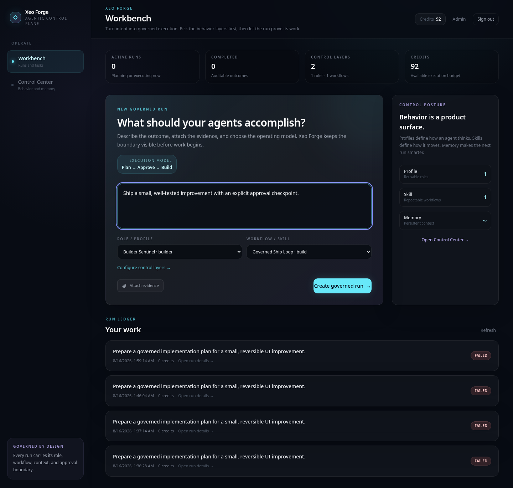
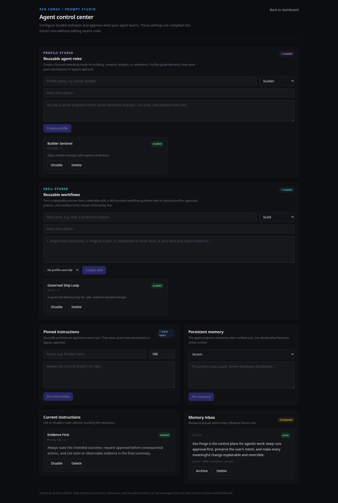
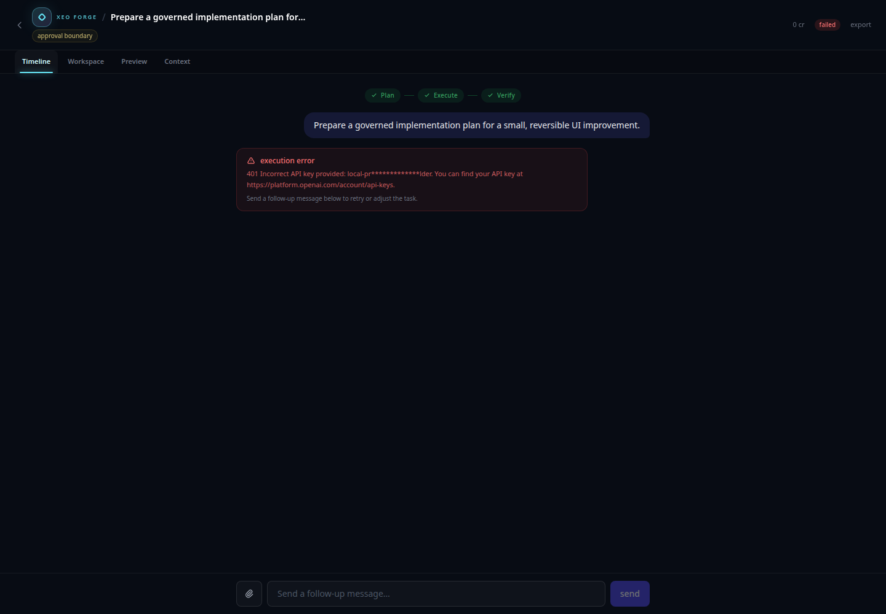
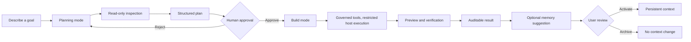

# Xeo Forge

<p align="center">
  
</p>

<h2 align="center">The Control Plane for Agentic Work</h2>

<p align="center">
  <em>Agents can act. Xeo Forge makes them accountable.</em>
</p>

<p align="center">
  <a href="https://github.com/lahkiri/xeo-forge/blob/master/LICENSE"></a>
  
  
  
  
  
</p>

Xeo Forge is a **local-first control plane for agentic work**. It gives software-building and knowledge-work agents a governed Work surface, a separate ordinary Chat surface, persistent context, reusable profiles and skills, workspace-scoped file boundaries, live event history, an optional user-controlled browser, and an installable desktop runtime.

The product is built around one principle:

> **Give your agent a forge, not a blank check.**

## What changed in v1.11.0

v1.11.0 — **Runtime Made Visible** — closes the gap between what the engine does and what the interface shows. The audit that started this release found a real bug: both client SSE handlers carried hardcoded event-type arrays that omitted `context_layers`, `memory`, and `memory_decision`, so v1.10.0's signature trust events were persisted, streamed, and then silently discarded by the browser. Chat subscribed to only four event types, which meant runtime state could never report "Reading project context".

| Capability | What it does |
|---|---|
| **Event registry** | `lib/agent/events.ts` declares all 21 event types once, with payload readers and per-surface subscriptions. `eventTypesFor('chat' \| 'work')` replaces both hardcoded arrays. A test scans the source for every `emitTaskEvent` call and fails if a type is undeclared — the dropped-event class of bug cannot recur. |
| **Execution timeline** | A real Activity surface built from the persisted event stream. Every row comes from `describeEvent()`; events with no standalone meaning render nothing rather than padding the list. Context compilation expands inline to name exactly which memories were injected. Deep mode shows raw event envelopes. |
| **Semantic primitives** | `AuthorityRow`, `RuntimeBanner`, `XeoFlow`, `ContextBudget`, `CurrentTruth`, `ResultArtifact` — components that understand the domain instead of generic cards. Each renders only from supplied backend state and shows nothing when a value is absent. |
| **Xeo Flow** | A clickable Context → Plan → Approval → Execute → Result trail derived from observable state only, never a step counter. Each stage opens the surface that explains it. |
| **Run commands** | `Cmd+K` gains run-scoped commands: open activity, inspect context, review memory, browse workspace, open preview, copy run ID. |

`authorityForMode()` mirrors what `executeTool` enforces at dispatch, and a test asserts it never describes restricted host execution as a sandbox and never reports browser interaction as plainly allowed.
## What changed in v1.10.0

v1.10.0 — **Persistent Context** — is the release where the agent gets more useful over time without becoming a black box. Memory, instructions, and runtime state all became inspectable and revocable.

| Capability | What it does |
|---|---|
| **Memory review** | The agent proposes bounded memory candidates at completion. They persist as `proposed` and are never injected into a run until you keep them. Keep, edit, or reject each one. |
| **Injection markers** | When an approved memory reaches a run, a `context_layers` event records exactly which ones. Memory never acts invisibly. |
| **Context Inspector** | Shows every context layer as in-prompt, withheld, overridden, or deduped, with the reason and a token estimate. Reads the same resolution pass the agent loop uses, so it cannot report a layer the model did not receive. |
| **Truthful runtime states** | `thinking...` is gone. Chat and Work now report queued, connecting, reading project context, using a named tool, writing the answer, compacting, retrying, or waiting for the provider - with elapsed time and a stall warning after 10s. |
| **CI on every push** | A `ci.yml` workflow runs typecheck, lint, tests, whitespace, browser smoke, broker tests, and build on push and pull request, not only at tag time. |

Detection in the Context Inspector is deterministic - scope specificity, disabled flags, approval status, expiry, duplicate content, and budget clamping. Xeo does not use a model to guess whether two instructions disagree.

## What changed in v1.9.0

v1.9.0 — **Chat is chat, Work is work** — split the two surfaces. Chat has no tabs, workspace browser, or approval controls because it cannot plan or write. Work leads with a governance rail showing live authority, plan state, project boundary, credits, and every file changed. The approval gate takes the full pane, and a `Cmd+K` command palette plus pane shortcuts make the whole app keyboard-reachable.

## What changed in v1.8.0

v1.8.0 hardened the foundation: the Go runtime broker binds loopback only and requires a shared secret for process control, the behavioral guards were consolidated into one implementation, and two test files that verified private copies of the logic were rewritten to import the shipped modules.
## What changed in v1.5.0

v1.5.0 — **Surface-Aware Workbench** — makes the product boundary explicit. Xeo Forge remains a SaaS control plane on the web, while the installed desktop application is a Local-First workbench: it opens directly into local projects, uses an internal local owner only for persistence compatibility, and does not expose credits, billing, account sign-in, multi-user administration, or SaaS navigation.

| Surface | Product identity |
|---|---|
| **Web SaaS** | Login, accounts, credits, multi-user administration, hosted persistence, and the existing operator controls remain available. |
| **Desktop Local** | Direct local workspace entry, project context, selected Browser Profile, local history, Control Center, and OTA updates without SaaS account chrome. |

The separation is enforced at both UI and server boundaries. Desktop Local hides SaaS navigation and returns a not-found response from credits and admin routes; local task creation and the agent loop bypass credit enforcement while hosted Web behavior remains unchanged.

## What changed in v1.4.0

Xeo Forge started as an approval-first coding agent. v1.4.0 turns that foundation into a local-first control plane for agentic work without removing the safety contract that made the project different. The release also establishes the desktop update path and the first cross-platform desktop packages.

| Layer | What it provides |
|---|---|
| **Governed runs** | A visible Plan -> Approve -> Build flow. Planning is read-only; write and execution tools remain locked until approval. |
| **Prompt Studio** | Manage pinned system, user, and task instructions from the UI instead of editing source code. |
| **Persistent memory** | Store deliberate, scoped, auditable memories. Runs propose bounded candidates; nothing enters context until you keep it. |
| **Agent Profiles** | Reusable roles such as Builder, Researcher, Analyst, Operator, or custom profiles. |
| **Agent Skills** | Reusable workflows that can be selected at task creation and combined with a profile. |
| **Context compiler** | Deterministic assembly of system policy, instructions, profile, skill, task context, and approved memories. |
| **Live audit trail** | Sequence-ordered events are persisted and streamed over SSE, so reloads preserve the same history. |
| **Restricted execution and preview** | Per-task file boundaries (realpath-checked), restricted host execution with an env whitelist and command blocklist, preview health checks, and workspace inspection. Not OS-level isolation — see Security posture. |
| **Operator controls** | Web SaaS authentication, credits, user administration, global model configuration, and task inspection; Desktop Local keeps only controls that operate locally. |
| **Intent Gate** | Separates ordinary Chat from Work intent and offers a short direct-versus-plan decision when a Work request asks for immediate execution. |
| **Browser Profiles** | Connect a Chromium extension to the browser profile the user chooses, persist that selection locally, and keep read-only browser inspection fail-closed. |
| **Desktop continuity** | Windows OTA Bootstrap from v1.3.1 onward, unattended restart installation in v1.4.0, and Linux AppImage/deb packages. |

## Product identity

**Xeo Forge is not another terminal wrapper and not a cloud-only agent.** Claude Code, Codex, and OpenCode are powerful execution surfaces for developers. Manus and Cowork are broader general-purpose agents. Xeo Forge occupies the local control-plane layer: it is the place where a person or team defines how agents should behave, what they may remember, which local browser they may inspect, what they may execute, who must approve them, and how their work is reviewed.

The short version is:

> **Your agents can execute. Xeo Forge gives execution a policy, a memory, an audit trail, and a proof of work.**

## Product preview

These previews are captured from the running application and represent the governed Workbench, Prompt Studio, and auditable task surface. The current desktop and Browser Profile work extends the same control model into a local installable environment.

| Command center | Prompt Studio |
|---|---|
|  |  |

| Governed run |
|---|
|  |

### Product tour

The launch film below is a cinematic product advertisement rather than a UI recording. It expresses the product promise—turning agentic acceleration into visible control—without relying on a live model run or exposing operational error states.

[](docs/xeo-forge-launch.mp4)

[Download the Xeo Forge launch film](docs/xeo-forge-launch.mp4).

## Core workflow



## Why the control plane matters

Most agent products optimize for autonomy. Xeo Forge optimizes for **useful autonomy with a visible boundary**. The agent can inspect a codebase, plan a change, edit files, execute verification, and show a preview, but the transition from planning to writing is explicit and persisted.

The same principle applies to memory. Xeo Forge does not silently treat every conversation as permanent training. It extracts bounded memory candidates only after successful work, records their source and confidence, and exposes approval, archive, and delete controls.

## Runtime guarantees

- Planning mode cannot write files or execute code, even if the model attempts to call a write tool.
- Approved plans are snapshotted before Build mode and are not silently rewritten during execution.
- Task events use one persisted sequence and one replay path, avoiding divergent in-memory histories.
- File and code access is confined to the task workspace with path checks and command guards.
- Credits are debited atomically and every balance change is recorded in a ledger.
- Model API keys are kept server-side; the application uses one global model configuration.
- Context usage is measured from the live message array and can trigger automatic compaction.
- Memory suggestions are scoped, bounded, source-linked, and reviewable. A proposed memory is never injected into a run; only an explicitly kept memory reaches context.
- Approved memories that reach a run are recorded as a `context_layers` event, so memory cannot act invisibly.
- The Context Inspector reads the same resolution pass the agent loop uses, so it cannot report a layer the model did not receive.
- Code execution is restricted host execution: an environment whitelist, realpath-checked workspace boundaries, and a dangerous-command blocklist. It is not OS-level isolation.

## Current scope and honest boundaries

v1.11.0 is a strong local-first foundation, not yet a full replacement for every capability in Manus, Claude Code, Codex, or OpenCode. The current release is strongest at controlled software-building workflows, operator visibility, local persistence, governed Browser Bridge actions, and reviewable memory.

The next product layers are intentionally separate from the current core and are tracked in the [1.x roadmap](docs/roadmap-1x.md):

1. Persistent Workspaces with members, files, policies, and workspace-level context.
2. First-class modes for Research, Review, Operate, and Build with mode-specific verification contracts.
3. Delegation to specialized agents with explicit budgets and parent-child audit trails.
4. Model routing and connector permissions for browsers, repositories, documents, and external services.
5. Schedules, resumable jobs, richer verification artifacts, and evaluation dashboards.

## Desktop, OTA, and Browser Bridge

Xeo Forge ships a thin Windows/Linux desktop shell for users who prefer an installable local workspace. The shell starts the production Next.js control plane on loopback, opens it in a hardened Electron window, and supervises local preview or worker processes through the native Go runtime broker.

The desktop build shares the same task governance, context compilation, and persistence contracts as the web app, but it is intentionally **surface-aware**. Desktop Local opens without a login wall and does not render or call SaaS-only credits, account, billing, or admin surfaces; Web SaaS retains those capabilities.

```bash
npm ci
npm run desktop:dev
npm run browser:smoke

# Windows NSIS installer on a Windows runner
npm run desktop:build:win

# Linux AppImage and deb packages on an Ubuntu runner
npm run desktop:build:linux
```

The minimum recommended installed version for receiving air updates is **v1.3.1**, the OTA Bootstrap. Users should always update to the latest release. In v1.4.0 and later, Windows `Restart to update` uses an unattended per-user NSIS install and should launch the new version directly. Linux AppImage is the preferred Linux package when air updates matter; deb is available for native package workflows.

The optional Browser Bridge connects the extension installed in the browser profile chosen by the user. Control Center lists connected profiles, persists the selected profile for Work, and never silently switches browsers when the selected profile disconnects. Read-only `state`, `read_page`, and `screenshot` are included by default; navigation and write-capable browser actions remain separately gated by the local safety policy, domain allowlist, explicit sensitive-action confirmation, and redaction rules.

See [`desktop/README.md`](desktop/README.md), [`docs/ota-bootstrap-protocol.md`](docs/ota-bootstrap-protocol.md), [`docs/browser-profile-v1.4.0.md`](docs/browser-profile-v1.4.0.md), [`docs/release-channels.md`](docs/release-channels.md), and [`docs/roadmap-1x.md`](docs/roadmap-1x.md).

## Multi-language architecture

Xeo Forge is intentionally polyglot by boundary, not by fashion. TypeScript remains the control plane because UI, API routes, agent orchestration, context compilation, and product policy benefit from one strict domain model. Go owns the narrow native runtime boundary where a small compiled process supervisor is useful for local workers and previews. SQL remains the persistence contract, and shell scripts are limited to build and packaging automation.

> Do not move agent reasoning or approval policy into Go until profiling shows a real bottleneck. The project gains more from explicit boundaries and better observability than from rewriting stable application code.

The first native component is documented in [`native/runtime-broker`](native/runtime-broker/README.md), while the Windows lifecycle is documented in [`desktop/README.md`](desktop/README.md).

## Quick start

### Local development with SQLite

```bash
git clone https://github.com/lahkiri/xeo-forge.git
cd xeo-forge
npm install
cp .env.example .env.local
```

Set `ROOT_ADMIN_EMAIL`, `ROOT_ADMIN_PASSWORD`, and the `MODEL_*` variables in `.env.local`, then initialize and run:

```bash
npm run db:init
npm run dev
```

Open <http://localhost:3000> for the Web SaaS surface, sign in as the root admin, and create a planning task. For the Desktop Local surface, use `npm run desktop:dev`; it enters the local workbench directly without an account login. A task starts in read-only Planning mode. Approve its plan before Build mode can write or execute.

### Self-hosting with Docker

Xeo Forge includes a production Dockerfile and a Compose stack for PostgreSQL:

```bash
cp .env.example .env
docker compose up -d --build
```

The `init` service creates the schema, seeds the root admin, and stores the initial global model configuration. The application container starts after initialization succeeds.

> **Security note:** `code_execute` runs inside the application container. The default container boundary is suitable for semi-trusted workloads, not a hostile multi-tenant threat model. For hostile tenants, use dedicated per-task containers or stronger VM-level isolation.

## Development commands

| Command | Purpose |
|---|---|
| `npm run dev` | Start the local development server. |
| `npm run typecheck` | Run strict TypeScript checks. |
| `npm test` | Run the Vitest suite. |
| `npm run build` | Build the production application. |
| `npm run db:init` | Create the schema and seed the initial admin and model settings. |
| `npm run desktop:dev` | Build the standalone app, prepare the native broker, and open the desktop shell. |
| `npm run desktop:build:win` | Produce the Windows NSIS installer on a Windows runner. |
| `npm run desktop:build:linux` | Produce Linux AppImage and deb packages on an Ubuntu runner. |
| `npm run browser:smoke` | Verify loopback authentication, Browser Profile registration, selection, routing, and fail-closed disconnect behavior. |

## Architecture at a glance

```text
app/                 Next.js pages and API routes
  api/               auth, tasks, context, profiles, skills, admin
lib/
  agent/             runner, loop, tools, prompts, context compiler, preview
  auth/              sessions and route guards
  credits/           atomic debit and ledger operations
  db/                adapter, schema, and the single query writer layer
  sse/               persisted event replay and live delivery
  types.ts           domain types and agent event contracts
native/
  runtime-broker/    Go process supervisor for local native workers
desktop/
  electron/          thin Windows/Linux desktop shell
  native/            generated broker binaries for packaging
docs/screenshots/       current product previews
  xeo-forge-v3-vision.md  product and architecture direction
  architecture-and-product-audit.md  product, runtime, and language-boundary audit
```

## Contributing

Keep the approval gate, persisted event ordering, atomic credits, task-scoped authorization, and strict type safety intact. New capabilities should complete the full path from user input to agent behavior, persistence, and UI; a button without an end-to-end route is not a feature.

Before opening a pull request, run:

```bash
npm run typecheck
npm test
npm run build
git diff --check
```

## License

MIT. See [LICENSE](LICENSE).
