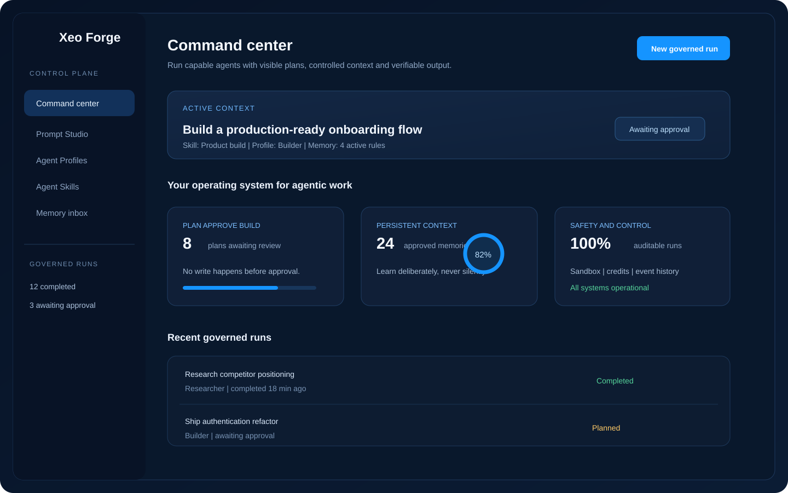
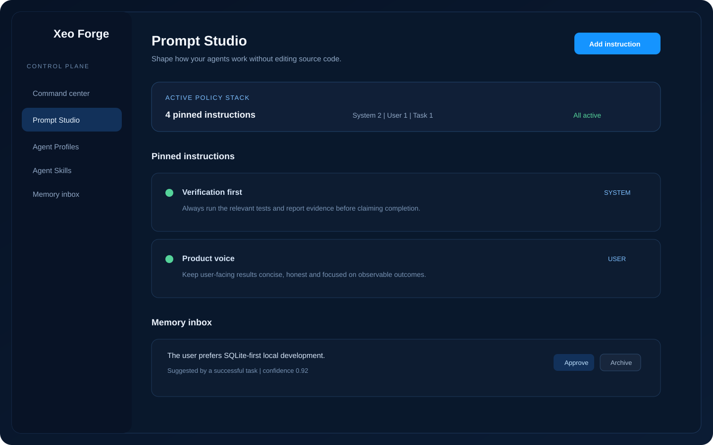
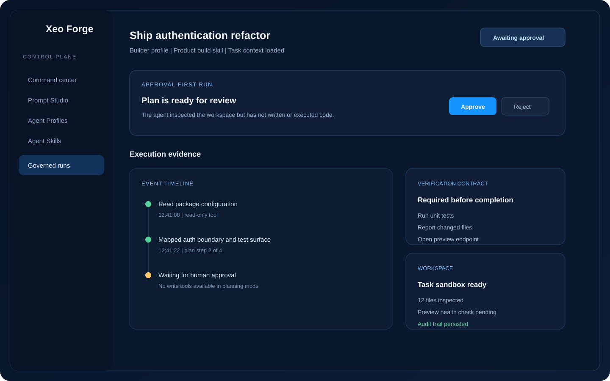
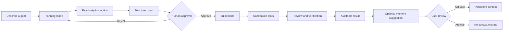

# Xeo Forge

<p align="center">
  
</p>

<h2 align="center">The Control Plane for Agentic Work</h2>

<p align="center">
  <em>Agents can act. Xeo Forge makes them accountable.</em>
</p>

<p align="center">
  <a href="https://github.com/lahkiri/xeo-forge/blob/master/LICENSE"></a>
  
  
  
  
  
</p>

Xeo Forge is a self-hosted platform for running **governed AI agents** across software-building and knowledge-work tasks. It combines an approval-first execution engine with persistent context, reusable agent roles, reusable skills, sandboxed workspaces, live event history, and operator controls.

The product is built around one principle:

> **Give your agent a forge, not a blank check.**

## What changed in V3

Xeo Forge started as an approval-first coding agent. V3 turns that foundation into a reusable control plane for agentic work without removing the safety contract that made the project different.

| Layer | What it provides |
|---|---|
| **Governed runs** | A visible Plan -> Approve -> Build flow. Planning is read-only; write and execution tools remain locked until approval. |
| **Prompt Studio** | Manage pinned system, user, and task instructions from the UI instead of editing source code. |
| **Persistent memory** | Store deliberate, scoped, auditable memories. Successful tasks may suggest memories; users decide what becomes active. |
| **Agent Profiles** | Reusable roles such as Builder, Researcher, Analyst, Operator, or custom profiles. |
| **Agent Skills** | Reusable workflows that can be selected at task creation and combined with a profile. |
| **Context compiler** | Deterministic assembly of system policy, instructions, profile, skill, task context, and approved memories. |
| **Live audit trail** | Sequence-ordered events are persisted and streamed over SSE, so reloads preserve the same history. |
| **Sandbox and preview** | Per-task file boundaries, guarded code execution, preview health checks, and workspace inspection. |
| **Operator controls** | Authentication, credits, user administration, global model configuration, and task inspection. |

## Product identity

**Xeo Forge is not another terminal wrapper.** Claude Code, Codex, and OpenCode are execution surfaces for developers. Manus and Cowork are broader general-purpose agents. Xeo Forge occupies a different layer: it is the place where an organization defines how agents should behave, what they may remember, what they may execute, who must approve them, and how their work is reviewed.

The short version is:

> **Your agents can execute. Xeo Forge gives execution a policy, a memory, an audit trail, and a proof of work.**

## V3 product preview

These previews reflect the current V3 product direction and replace the earlier V2 screenshots.

| Command center | Prompt Studio |
|---|---|
|  |  |

| Governed run |
|---|
|  |

## Core workflow



## Why the control plane matters

Most agent products optimize for autonomy. Xeo Forge optimizes for **useful autonomy with a visible boundary**. The agent can inspect a codebase, plan a change, edit files, execute verification, and show a preview, but the transition from planning to writing is explicit and persisted.

The same principle applies to memory. Xeo Forge does not silently treat every conversation as permanent training. It extracts bounded memory candidates only after successful work, records their source and confidence, and exposes approval, archive, and delete controls.

## Runtime guarantees

- Planning mode cannot write files or execute code, even if the model attempts to call a write tool.
- Approved plans are snapshotted before Build mode and are not silently rewritten during execution.
- Task events use one persisted sequence and one replay path, avoiding divergent in-memory histories.
- File and code access is confined to the task workspace with path checks and command guards.
- Credits are debited atomically and every balance change is recorded in a ledger.
- Model API keys are kept server-side; the application uses one global model configuration.
- Context usage is measured from the live message array and can trigger automatic compaction.
- Memory suggestions are scoped, bounded, source-linked, and reviewable.

## Current scope and honest boundaries

V3 is a strong foundation for a governed agent platform, not yet a full replacement for every capability in Manus, Claude Code, Codex, or OpenCode. The current release is strongest at controlled software-building workflows and operator visibility.

The next product layers are intentionally separate from the current core:

1. Persistent Workspaces with members, files, policies, and workspace-level context.
2. First-class modes for Research, Review, Operate, and Build with mode-specific verification contracts.
3. Delegation to specialized agents with explicit budgets and parent-child audit trails.
4. Model routing and connector permissions for browsers, repositories, documents, and external services.
5. Schedules, resumable jobs, richer verification artifacts, and evaluation dashboards.

## Quick start

### Local development with SQLite

```bash
git clone https://github.com/lahkiri/xeo-forge.git
cd xeo-forge
npm install
cp .env.example .env.local
```

Set `ROOT_ADMIN_EMAIL`, `ROOT_ADMIN_PASSWORD`, and the `MODEL_*` variables in `.env.local`, then initialize and run:

```bash
npm run db:init
npm run dev
```

Open <http://localhost:3000>, sign in as the root admin, and create a planning task. A task starts in read-only Planning mode. Approve its plan before Build mode can write or execute.

### Self-hosting with Docker

Xeo Forge includes a production Dockerfile and a Compose stack for PostgreSQL:

```bash
cp .env.example .env
docker compose up -d --build
```

The `init` service creates the schema, seeds the root admin, and stores the initial global model configuration. The application container starts after initialization succeeds.

> **Security note:** `code_execute` runs inside the application container. The default container boundary is suitable for semi-trusted workloads, not a hostile multi-tenant threat model. For hostile tenants, use dedicated per-task containers or stronger VM-level isolation.

## Development commands

| Command | Purpose |
|---|---|
| `npm run dev` | Start the local development server. |
| `npm run typecheck` | Run strict TypeScript checks. |
| `npm test` | Run the Vitest suite. |
| `npm run build` | Build the production application. |
| `npm run db:init` | Create the schema and seed the initial admin and model settings. |

## Architecture at a glance

```text
app/                 Next.js pages and API routes
  api/               auth, tasks, context, profiles, skills, admin
lib/
  agent/             runner, loop, tools, prompts, context compiler, preview
  auth/              sessions and route guards
  credits/           atomic debit and ledger operations
  db/                adapter, schema, and the single query writer layer
  sse/               persisted event replay and live delivery
  types.ts           domain types and agent event contracts
docs/
  screenshots/       current V3 product previews
  xeo-forge-v3-vision.md  product and architecture direction
```

## Contributing

Keep the approval gate, persisted event ordering, atomic credits, task-scoped authorization, and strict type safety intact. New capabilities should complete the full path from user input to agent behavior, persistence, and UI; a button without an end-to-end route is not a feature.

Before opening a pull request, run:

```bash
npm run typecheck
npm test
npm run build
git diff --check
```

## License

MIT. See [LICENSE](LICENSE).
