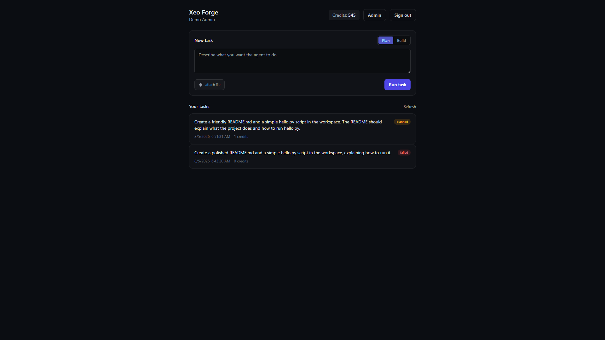
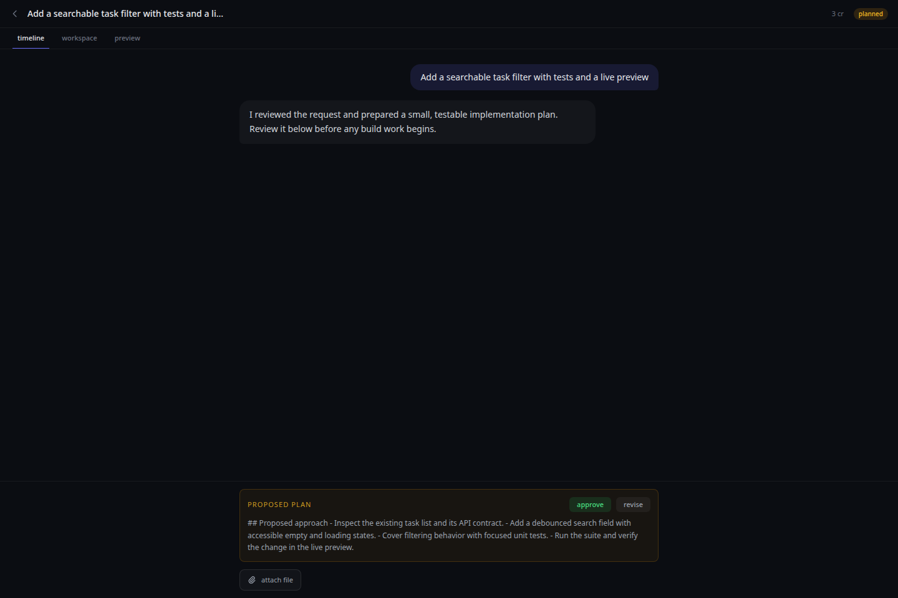
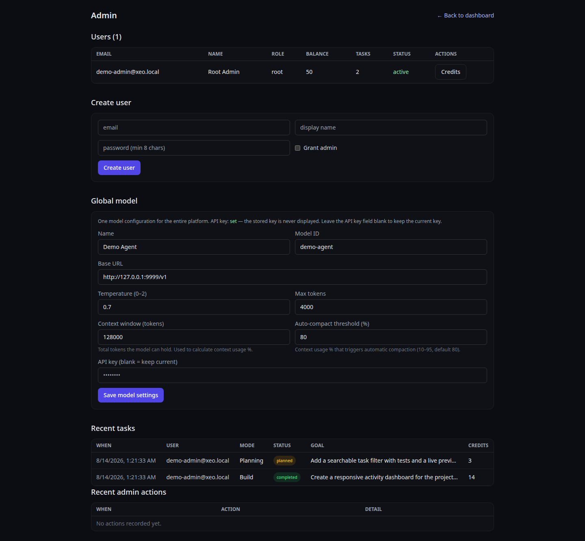

# Xeo Forge

<p align="center">
  
</p>

<h3 align="center">Autonomous AI Agent Platform</h3>

<p align="center">
  <em>Plan. Approve. Build. Ship. One agent, two modes, zero babysitting.</em>
</p>

<p align="center">
  <a href="https://github.com/lahkiri/xeo-forge/blob/master/LICENSE">
    
  </a>
  <a href="https://github.com/lahkiri/xeo-forge/releases">
    
  </a>
  
  
  
  
  
</p>

---

## What is Xeo Forge?

Xeo Forge is an **autonomous AI agent platform** that runs any task through a two-phase,
human-approved workflow:

1. **Planning Mode** — the agent inspects your request (read-only) and produces a structured
   plan. Nothing is written yet.
2. **Build Mode** — once you approve the plan, the agent executes it with full tool access:
   file editing, code execution, HTTP requests, and a live workspace preview.

Every step is streamed to the UI in real time and persisted to the database, so you can
reload the page and pick up exactly where you left off. Users get credit-based budgets,
admins get full inspection and control, and the entire platform runs on **one global model**
you configure once.

## Product Positioning

**The approval-first coding agent you can self-host.**

Xeo Forge is built for solo developers, internal tools teams, and privacy-conscious
organizations that want an agent to do real work without giving up visibility or control.
The product promise is simple: the agent can move quickly, but it cannot move silently.
Every build starts from a human-approved plan, every meaningful step is visible, and the
workspace can run on infrastructure you own.

Use this launch message in demos, README posts, and community announcements:

> **Give your AI agent a forge, not a blank check.** Plan with confidence, approve the
> approach, then let Xeo Forge build and show its work.

---

## Key Features

### Dual-Mode Execution
- **Planning** — read-only analysis. Write tools are hard-locked at the dispatch level.
- **Build** — full execution of the immutable approved plan.
- **Approval Gate** — approve or reject before any write happens (atomic, race-safe).

### Real-Time Streaming
- Server-Sent Events (SSE) with a single delivery path: replay from DB, then live events.
- Events are **never** kept in memory — reload shows the same history.

### Credit System
- Atomic credit debits (`UPDATE ... WHERE balance >= ?`), full ledger with `balance_after`.
- Daily credit grants, admin adjustments, per-task spend tracking.

### Agent Runtime Safety
- Stagnation detection, read-only loop detection, and text-termination guards.
- Per-task sandboxed workspaces with path confinement + command blocklists.
- Adaptive execution with stagnation detection, credit budgets, and a hard safety ceiling.

### Context Management
- Real context-usage percentage computed from the live message array.
- Automatic compaction at an admin-configurable threshold (default 80%).

### Admin Panel
- Inspect any user, task, or ledger entry; adjust credits; suspend users.
- Edit the single global model config (API key never exposed).

---

## Screenshots

| Dashboard (approval-first flow) | Live task view (proposed plan) |
|-------------------------------------|--------------------------------|
|  |  |

| Admin panel (users + recent tasks) |
|------------------------------------|
|  |

---

## Quick Start (local dev, SQLite)

> The simplest way to try Xeo Forge locally. Uses SQLite — zero setup.

```bash
git clone https://github.com/lahkiri/xeo-forge.git
cd xeo-forge

npm install

# Configure environment
cp .env.example .env.local
# Edit .env.local: ROOT_ADMIN_EMAIL/PASSWORD and MODEL_* (model is required)

# Initialize the database (schema + root admin + model settings)
npm run db:init

# Start the dev server
npm run dev
```

Open http://localhost:3000, sign in as the root admin, and create a task.

---

## Self-Hosting with Docker (recommended)

Xeo Forge ships with a production `Dockerfile` (Next.js standalone) and a `docker-compose.yml`
that runs **PostgreSQL + schema init + the app** as one stack.

### 1. Configure

```bash
cp .env.example .env
```

Edit `.env` — at minimum set:

| Variable | Meaning |
|----------|---------|
| `ROOT_ADMIN_EMAIL` / `ROOT_ADMIN_PASSWORD` | Initial admin account (seeded on first boot) |
| `MODEL_BASE_URL` / `MODEL_API_KEY` / `MODEL_ID` | The single global model (OpenAI-compatible endpoint) |
| `POSTGRES_USER` / `POSTGRES_PASSWORD` | Your DB credentials (used by the compose file) |

### 2. Start

```bash
docker compose up -d --build
```

The `init` service creates the schema, seeds the root admin, and writes the model
configuration; the `app` service only starts after init completes successfully.

Open http://localhost:3000 and log in with the root admin credentials.

### 3. Operating

```bash
docker compose logs -f app      # watch the app
docker compose ps               # status
docker compose down             # stop (data persists in the pgdata volume)
docker compose down -v          # stop AND wipe the database
```

To change the model later, log in as an admin and edit it in **Admin → Model** — the
database row is the source of truth (env only seeds the initial value).

> **Note on `code_execute`:** the agent runs bash/python inside the app container.
> That container is confined by Docker but shares the host kernel — treat agent
> tasks as semi-trusted. In a multi-tenant deployment, consider running the agent
> in dedicated per-task containers/VM isolation.

---

## Environment Variables

| Variable | Required | Default | Description |
|----------|----------|---------|-------------|
| `DATABASE_URL` | prod | – | PostgreSQL connection string. Unset = SQLite (dev). In `NODE_ENV=production` a URL is **required**. |
| `DB_PATH` | no | `data/xeo.db` | SQLite file location (dev only). |
| `PG_STRICT_SSL` | no | – | `1` to require SSL for Postgres (managed hosts). |
| `ROOT_ADMIN_EMAIL` | yes | – | Root admin email (seeded by `db:init`). |
| `ROOT_ADMIN_PASSWORD` | yes | – | Root admin password. |
| `MODEL_BASE_URL` | yes | – | OpenAI-compatible API base URL. |
| `MODEL_API_KEY` | yes | – | API key. **Never exposed to clients.** |
| `MODEL_ID` | no | `gpt-4o-mini` | Model identifier. |
| `MODEL_NAME` | no | = `MODEL_ID` | Display name. |
| `MODEL_TEMPERATURE` | no | `0.7` | Sampling temperature. |
| `MODEL_MAX_TOKENS` | no | `4000` | Max tokens per response. |
| `MODEL_CONTEXT_WINDOW` | no | `128000` | Model context window (tokens) — usage-% denominator. |
| `MODEL_AUTO_COMPACT_THRESHOLD` | no | `80` | Context usage % that triggers compaction (10–95). |
| `DEFAULT_DAILY_GRANT` | no | `50` | Daily free credits per user. |
| `CREDIT_TASK_CREATE` | no | `2` | Credits debited to create a task. |
| `CREDIT_PER_TOOL_CALL` | no | `1` | Credits debited per agent tool call. |
| `COOKIE_SECURE` | no | – | `1` when serving over HTTPS (Secure cookies). |
| `TASK_WORK_DIR` | no | `/tmp/xeo-tasks` | Root of per-task sandboxed workspaces. |

---

## API Endpoints

### Authentication
| Method | Endpoint | Description |
|--------|----------|-------------|
| `POST` | `/api/auth/register` | Create account |
| `POST` | `/api/auth/login` | Sign in |
| `POST` | `/api/auth/logout` | Sign out |
| `GET` | `/api/auth/me` | Current user |

### Tasks
| Method | Endpoint | Description |
|--------|----------|-------------|
| `GET` | `/api/tasks` | List my tasks |
| `POST` | `/api/tasks` | Create a planning task (`{ goal }`; build starts only after approval) |
| `GET` | `/api/tasks/:id` | Get task |
| `GET` | `/api/tasks/:id/stream` | SSE event stream |
| `POST` | `/api/tasks/:id/approve` | Approve plan → start build |
| `POST` | `/api/tasks/:id/reject` | Reject plan → re-plan |
| `POST` | `/api/tasks/:id/mode` | Switch to planning, or resume Build only with an approved plan |
| `GET` | `/api/tasks/:id/messages` | Conversation messages |
| `POST` | `/api/tasks/:id/messages` | Send follow-up message |
| `POST` | `/api/tasks/:id/uploads` | Upload task files |
| `GET` | `/api/tasks/:id/preview` | Preview info |
| `GET` | `/api/tasks/:id/workspace` | List workspace files |
| `POST` | `/api/tasks/:id/export` | Export task data |

### Credits
| Method | Endpoint | Description |
|--------|----------|-------------|
| `GET` | `/api/credits` | Balance + ledger history |

### Admin (admin only)
| Method | Endpoint | Description |
|--------|----------|-------------|
| `GET` | `/api/admin/users` | List users with stats |
| `PATCH` | `/api/admin/users/:id` | Update user (role / suspension) |
| `POST` | `/api/admin/users/:id/credits` | Adjust credits |
| `GET` | `/api/admin/tasks` | List all tasks (any user) |
| `GET/PUT` | `/api/admin/model` | Read/update global model config |

---

## Tech Stack

| Layer | Technology |
|-------|------------|
| Framework | Next.js 14 (App Router) |
| UI | React 18 + Tailwind CSS |
| Language | TypeScript 5 (strict) |
| Database | SQLite (dev) / PostgreSQL (prod) — one adapter |
| AI | `openai` SDK (streaming tool calls) |
| Auth | Cookie sessions (random 32-byte tokens, sha256 hashed) |
| Testing | Vitest |
| Validation | Zod |

---

## Commands

```bash
npm run dev          # Start development server
npm run build        # Production build (standalone output)
npm start            # Start production server
npm test             # Run tests (Vitest)
npm run typecheck    # tsc --noEmit (must stay clean)
npm run db:init      # Create schema + seed root admin + model
docker compose up -d # Self-host with PostgreSQL (see above)
```

---

## Architecture Notes

- **Single source of truth.** One schema per entity, one writer per resource, no dual persistence.
- **One delivery path for events.** Task events carry a monotonic per-task `seq`; SSE replays
  from the DB and forwards live events — no in-memory replay buffer.
- **One global model.** `model_settings` row `id=1` is authoritative; API keys are always masked.
- **Atomic credits.** Conditional `UPDATE ... WHERE balance >= ?` + ledger rows with `balance_after`.
- **No silent failures.** Every caught error is logged; persistence failures are visible.

---

## License

MIT License. See [LICENSE](LICENSE) for details.
